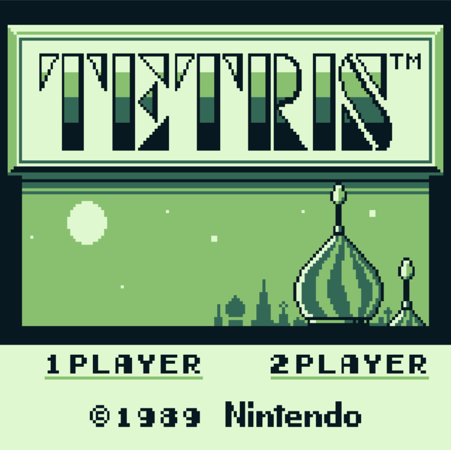
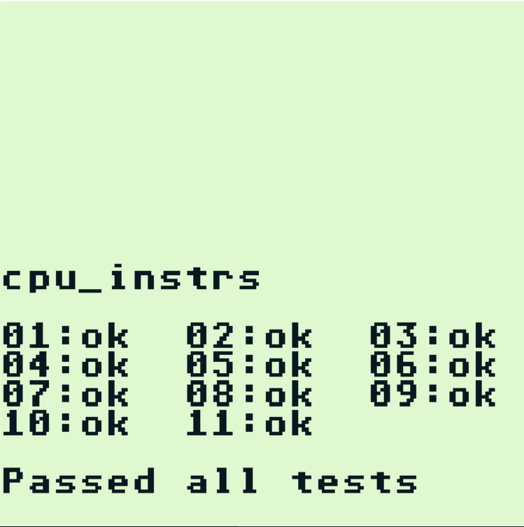

# Gameboy Emulator: GBMoo

This project is my WIP attempt at making a Gameboy Emulator.

The end goal is to be able to run Pokemon Red/Blue

## About the Project

This emulator is written in C++ and uses SDL for inputs and eventually sound and uses OpenGL for graphics

Currently the repo has been rolled back to an SDL version for some further testing, but using the commented out OpenGL code it can be made
 to use OpenGL

## Using This Repo

You can use the MakeFile 

Or compile manually (take a look at the Makefile) 

You must find your own ROMs, I cannot provide any 

If you are interested in improving this emulator feel free to submit some PRs :D 

## Some Screenshots

#### Test Suite
